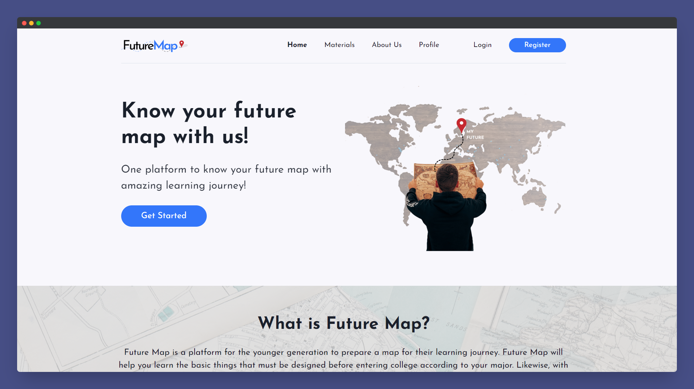

# Final Project Kelompok 53



---

## Table of Contents

- ⚙️ [Backend](#backend)
  - [Teknologi Backend](#teknologi-backend)
  - [Development Backend](#development-backend)
  - [Contoh Response](#contoh-response)
- 🖼 [Frontend](#frontend)
  - [Teknologi Frontend](#teknologi-frontend)
  - [Package Penting](#package-penting)
  - [Development Frontend](#development-frontend)
- 😎 [Anggota Kelompok](#anggota-kelompok)

---

## Backend

Buka terminal favorit kalian dan jalankan perintah-perintah berikut ini. Selain itu juga disediakan _build version_ berupa file exe.

### 📚 Teknologi Backend

- Golang
- Gin Gonic
- JWT-GO
- Cloud Firestore (Firebase)

### 🛠 Development Backend

Untuk menjalankan Project Backend:

```bash
go run main.go
```

Untuk menambahkan Admin:

```bash
localhost:8080/admin/register
```

Untuk login Admin:

```bash
localhost:8080/login
```

### 📲 Contoh Response

JSON data Admin register:

```json
{
  "username": "admin",
  "phone": "12345",
  "email": "admin123",
  "password": "admin12345"
}
```

JSON data Admin login:

```json
{
  "email": "admin123",
  "password": "admin12345"
}
```

Contoh response register dan login untuk User, sama dengan Admin.

---

## Frontend

Berikut ini adalah panduan instalasi hingga cara menjalankan local development pada Project Frontend.

### 📚 Teknologi Frontend

- React-js
- Axios
- Chakra UI
- Emotion
- Zustand
- json-server & json-server-auth (development)

### 📦 Package Penting

Ada 3 package/library penting yang digunakan disini, yaitu:

- Chakra UI
- Axios
- JSON Server (hanya untuk development)

Khusus untuk JSON Server, pastikan sudah ter-install di PC masing-masing. Jika belum, lakukan instalasi secara global.

```bash
npm install -g json-server
```

Kemudian, pastikan juga seluruh dependensi yang dibutuhkan telah ter-install.

```bash
npm install
```

### 🛠 Development Frontend

Kita harus menjalankan 2 local sever pada project ini. Satu untuk `react-js` dan satunya lagi untuk local `json-sever` beserta `json-server-auth` yang berfungsi sebagai endpoint API sementara.

**react-js**

```bash
npm run start
```

**json-server + json-server-auth** (dengan custom port: 8000)

```bash
json-server _data/db.json -m ./node_modules/json-server-auth --port 8000
```

Kemudian periksa url [http://localhost:3000](http://localhost:3000) pada browser untuk melihat hasilnya.

---

## Anggota Kelompok

- Ilham Mubarok - FE2103788 👨‍💻
- Wahyu Widi Widayat - BE2236237 👨‍💻
- Nisa Fatimatuz Zahro - FE2239109 👩‍💻
- Sity Fadia Al Haya Maswin - FE2211285 👩‍💻
- Galuh Berli Oktaviami - BE2287239 👩‍💻
- Putri Wahyulian Aningtyas - FE2211350 👀
